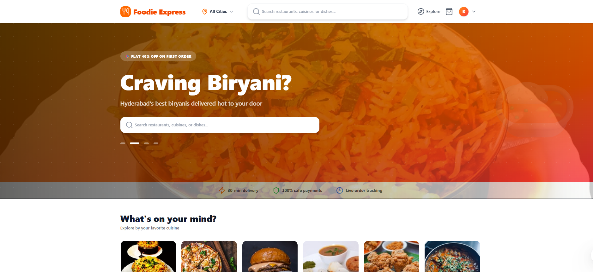
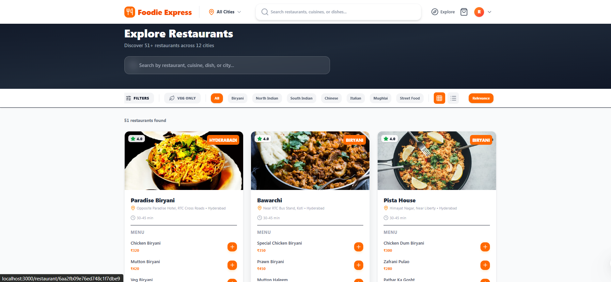
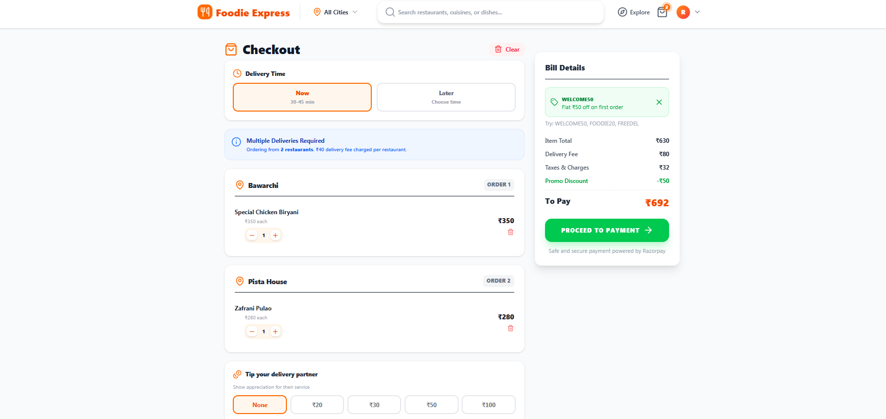
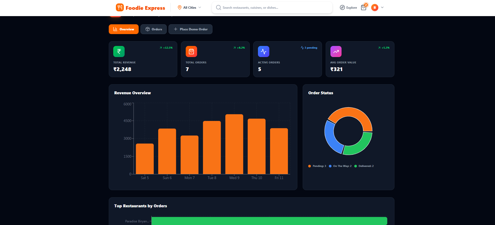
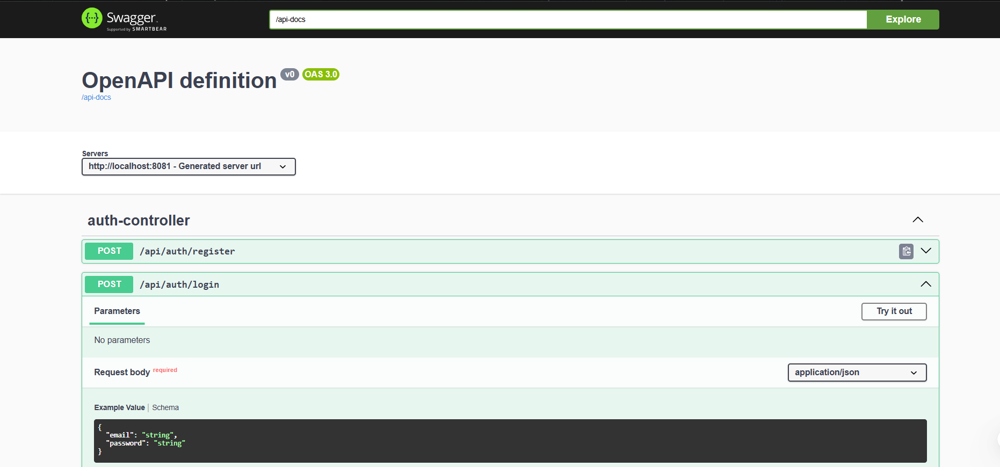

<div align="center">

# 🍔 Foodie Express

### Full-Stack Enterprise Food Delivery Platform

**React 19 + Spring Boot 3 + Docker + PostgreSQL + MongoDB + Redis + Razorpay**

[](https://reactjs.org/)
[](https://spring.io/projects/spring-boot)
[](https://www.docker.com/)
[](https://www.postgresql.org/)
[](https://www.mongodb.com/)
[](LICENSE)

</div>

---

## 📋 Table of Contents

- [Overview](#-overview)
- [Architecture](#-architecture)
- [Tech Stack](#-tech-stack)
- [Features](#-features)
- [Services](#-services)
- [API Endpoints](#-api-endpoints)
- [Database Schema](#-database-schema)
- [Getting Started](#-getting-started)
- [Project Structure](#-project-structure)
- [Screenshots](#-screenshots)
- [Future Scope](#-future-scope)

---

## 🌟 Overview

Foodie Express is a **production-grade microservices-based food delivery platform** inspired by Swiggy/Zomato. It features 45+ restaurants across 14 Indian cities, real-time order tracking, Razorpay payment integration, and a full enterprise admin dashboard with analytics.

### Key Highlights
- **4 Microservices** with independent databases
- **3 Infrastructure Services** (PostgreSQL, MongoDB, Redis — all actually used)
- **45+ Restaurants** across 14 cities with real food images
- **Enterprise Admin Dashboard** with Recharts analytics
- **Razorpay Payment Gateway** with demo mode
- **JWT Authentication** with role-based access control

---

## 🏗️ Architecture

```
┌──────────────────────────────────────────────────────────────────┐
│                        CLIENT (React 19)                        │
│                    Port: 5173 (Vite Dev)                         │
└──────────────────────────┬───────────────────────────────────────┘
                           │ HTTP
                           ▼
┌──────────────────────────────────────────────────────────────────┐
│                     API GATEWAY (Spring Cloud)                   │
│                        Port: 8080                                │
│               Routes / Auth / Rate Limiting / CORS               │
└──────┬──────────────────────┬──────────────────────┬─────────────┘
       │                      │                      │
       ▼                      ▼                      ▼
┌──────────────┐    ┌──────────────────┐    ┌──────────────────┐
│  USER SERVICE│    │RESTAURANT SERVICE│    │  ORDER SERVICE   │
│  Port: 8081  │    │   Port: 8082     │    │   Port: 8083     │
│              │    │                  │    │                  │
│  PostgreSQL  │    │    MongoDB       │    │   PostgreSQL     │
│ foodie_users │    │    foodiedb      │    │  foodie_orders   │
└──────────────┘    └──────────────────┘    └──────────────────┘

┌──────────────────────────────────────────────────────────────────┐
│                    INFRASTRUCTURE (Docker)                       │
│  PostgreSQL │ MongoDB │ Redis (cache)  │
│  Port:5432  │Port:27017│Port:6379       │
└──────────────────────────────────────────────────────────────────┘
```
(Roadmap infra — Kafka/Zookeeper/Elasticsearch — lives in `docker-compose.messaging.yml`, not started by default.)

### Request Flow
```
Client → API Gateway → [JWT Validation] → Microservice → Database
                           ↓
                     Redis Cache (restaurant listings, 10-min TTL)
```

---

## 🔧 Tech Stack

### Backend
| Technology | Purpose |
|---|---|
| **Java 21** | Programming language |
| **Spring Boot 3.2** | REST API framework |
| **Spring Cloud Gateway** | API Gateway with routing |
| **Spring Security** | JWT Authentication & Authorization |
| **Spring Data JPA** | PostgreSQL ORM |
| **Spring Data MongoDB** | MongoDB data access |
| **JWT (jjwt 0.11.5)** | Token generation & validation |
| **Lombok** | Boilerplate reduction |
| **Razorpay SDK** | Payment gateway integration |
| **BCrypt** | Password hashing |

### Frontend
| Technology | Purpose |
|---|---|
| **React 19** | UI framework |
| **React Router v7** | Client-side routing |
| **Tailwind CSS v4** | Utility-first styling |
| **Framer Motion** | Animations & transitions |
| **Recharts** | Admin dashboard charts |
| **Axios** | HTTP client with interceptors |
| **Lucide React** | Icon library |
| **React Hot Toast** | Notification system |
| **Vite 8** | Build tool & dev server |

### Infrastructure
| Technology | Purpose |
|---|---|
| **Docker & Docker Compose** | Containerization (8 services by default) |
| **PostgreSQL 15** | Relational database (Users, Orders) |
| **MongoDB 7** | Document database (Restaurants) |
| **Redis 7** | Restaurant listing cache (10-min TTL) |

> Roadmap infra (Kafka event streaming, Elasticsearch search) is reserved in `docker-compose.messaging.yml` and not started by default — see [Future Scope](#-future-scope).

---

## ✨ Features

### Customer Features
- 🏙️ **14 Cities** — Hyderabad, Mumbai, Delhi, Bangalore, Pune, Kolkata, Chennai, Jaipur, Ahmedabad, Lucknow, Goa, Chandigarh, Jalgaon
- 🍽️ **45+ Restaurants** with real food images from Unsplash
- 🔍 **Smart Search** — Search by restaurant, cuisine, dish, or city with autocomplete
- 🎨 **Cuisine Categories** — 12 cuisine types with visual cards
- 🛒 **Smart Cart** — Single-city policy, multi-restaurant support, quantity controls
- 💳 **5 Payment Methods** — UPI, Card, Netbanking, Wallets, Cash on Delivery
- 🏷️ **Promo Codes** — WELCOME50, FOODIE20, FREEDEL, HUNGRY30
- 💰 **Driver Tips** — ₹0/20/30/50/100 options
- ⏰ **Delivery Slots** — Now or Later scheduling
- 📍 **Live Order Tracking** — 4-step visual timeline with 5-second auto-poll
- ⭐ **Restaurant Reviews** — Customer ratings and feedback
- 👤 **User Profile** — Saved addresses, order history, account settings
- 📱 **Mobile Responsive** — Bottom navigation, touch-optimized

### Admin Features
- 📊 **Analytics Dashboard** — Revenue charts, order distribution, restaurant performance
- 📈 **Recharts Visualizations** — Bar charts, pie charts, horizontal bar charts
- 🚚 **Order Management** — Dispatch, mark delivered, status tracking
- 👥 **Customer Insights** — Unique customers, delivery rate, avg order value
- 🔄 **Real-time Updates** — Live sync with auto-refresh

### Technical Features
- 🔐 **JWT Authentication** — Secure token-based auth with refresh
- 🛡️ **Role-based Access** — Customer vs Admin routes (admin can never self-register)
- ✅ **Bean Validation** — `@Valid` request DTOs + global `@ControllerAdvice` error format
- 📖 **Swagger/OpenAPI** — `/swagger-ui.html` on every service
- ❤️ **Actuator Health** — `/actuator/health` on every service
- ⚡ **Redis Caching** — Restaurant list + city queries cached 10 min, evicted on writes
- 🌐 **API Gateway** — Centralized routing, CORS, error handling
- 🐳 **Docker Ready** — One command to start entire stack (incl. UI on :3000)
- 💥 **Error Boundaries** — Graceful React error handling
- ✨ **Loading Skeletons** — Shimmer animations during data fetch
- 🎭 **Framer Motion** — Page transitions, card animations, micro-interactions

---

## 📦 Services

### 1. API Gateway (Port 8080)
Spring Cloud Gateway with route predicates:

| Route | Path | Target |
|---|---|---|
| user-service | `/api/auth/**` | `http://user-service:8081` |
| restaurant-service | `/api/restaurants/**` | `http://restaurant-service:8082` |
| order-service | `/api/orders/**`, `/api/payments/**` | `http://order-service:8083` |

### 2. User Service (Port 8081)
- **Database**: PostgreSQL (`foodie_users`)
- **Auth**: JWT token generation, BCrypt password hashing
- **Entities**: User (id, fullName, email, password, Role)

### 3. Restaurant Service (Port 8082)
- **Database**: MongoDB (`foodiedb`)
- **Data**: 45+ seeded restaurants with menus
- **Entities**: Restaurant (id, name, address, cuisineType, city, imageUrl, menu[])

### 4. Order Service (Port 8083)
- **Database**: PostgreSQL (`foodie_orders`)
- **Payment**: Razorpay integration with demo mode
- **Entities**: FoodOrder (id, userEmail, restaurantName, items, totalAmount, status, payment fields)

---

## 🔌 API Endpoints

### Authentication
| Method | Endpoint | Description |
|---|---|---|
| `POST` | `/api/auth/register` | Register new user |
| `POST` | `/api/auth/login` | Login (returns JWT + user data) |

### Restaurants
| Method | Endpoint | Description |
|---|---|---|
| `GET` | `/api/restaurants` | Get all restaurants |
| `GET` | `/api/restaurants/city/{city}` | Filter by city |
| `GET` | `/api/restaurants/{id}` | Get restaurant by ID |
| `POST` | `/api/restaurants` | Add new restaurant |

### Orders
| Method | Endpoint | Auth | Description |
|---|---|---|---|
| `POST` | `/api/orders` | ✅ | Place new order |
| `GET` | `/api/orders/{email}` | ✅ | Get user orders |
| `GET` | `/api/orders/all` | 🔒 Admin | Get all orders |
| `PUT` | `/api/orders/{id}/status` | 🔒 Admin | Update order status |

### Payments
| Method | Endpoint | Auth | Description |
|---|---|---|---|
| `POST` | `/api/payments/create-order` | ✅ | Create Razorpay order |
| `POST` | `/api/payments/verify` | ✅ | Verify payment signature |

### Promos (server-validated)
| Method | Endpoint | Auth | Description |
|---|---|---|---|
| `GET` | `/api/orders/promos` | ✅ | List public promo codes + rules |
| `POST` | `/api/orders/promos/validate` | ✅ | Validate `{code, itemTotal, deliveryFee}` → `{valid, discount, message}` |

> Pricing: delivery fee = ₹40 × restaurant count (max 5), tax = 5%. `placeOrder` re-validates the promo server-side and rejects forged discounts.

---

## 🔒 Security Notes (demo tradeoffs)

- JWT is stored in `localStorage` for simplicity — vulnerable to XSS. Production should use `httpOnly` cookies + refresh rotation + CSP.
- Admin can never self-register (`ROLE_ADMIN` allowlist blocked); promote via SQL.
- All request DTOs use Bean Validation + global `@ControllerAdvice` error format.

---

## 🗄️ Database Schema

### PostgreSQL — `foodie_users`
```
users
├── id BIGSERIAL PRIMARY KEY
├── full_name VARCHAR(255)
├── email VARCHAR(255) UNIQUE
├── password VARCHAR(255) [BCrypt]
└── role ENUM('ROLE_ADMIN', 'ROLE_USER')
```

### PostgreSQL — `foodie_orders`
```
food_orders
├── id BIGSERIAL PRIMARY KEY
├── customer_email VARCHAR(255)
├── restaurant_name VARCHAR(255)
├── items TEXT[]
├── total_amount DOUBLE PRECISION
├── status VARCHAR(50)
├── order_time TIMESTAMP
├── razorpay_order_id VARCHAR(255)
├── razorpay_payment_id VARCHAR(255)
├── razorpay_signature VARCHAR(255)
└── payment_method VARCHAR(50)
```

### MongoDB — `foodiedb`
```
restaurants (collection)
├── _id ObjectId
├── name String
├── address String
├── cuisineType String
├── city String
├── imageUrl String
└── menu Array
    └── MenuItem
        ├── name String
        ├── description String
        ├── price Double
        └── isVegetarian Boolean
```

---

## 🚀 Getting Started

### Prerequisites
- **Java 21+**
- **Node.js 18+**
- **Docker & Docker Compose**
- **Maven 3.9+**

### 1. Clone the Repository
```bash
git clone https://github.com/Bhushan2602/Foodie-Express-Project.git
cd Foodie-Express-Project
# Copy env template and fill in secrets (never commit .env)
cp .env.example .env
```

### 2. Start Infrastructure & Services
```bash
docker-compose up --build
```

This starts:
- PostgreSQL (5432), MongoDB (27017), Redis (6379)
- User Service (8081), Restaurant Service (8082), Order Service (8083)
- API Gateway (8080), UI (3000)

Roadmap infra (Kafka, Elasticsearch) starts separately when needed:
```bash
docker compose -f docker-compose.yml -f docker-compose.messaging.yml up --build -d
```

### 3. Start Frontend
```bash
cd foodie-express-ui
npm install
npm run dev
```

### 4. Access the Application
| Service | URL |
|---|---|
| **Frontend (Vite)** | http://localhost:5173 |
| **Frontend (Docker)** | http://localhost:3000 |
| **API Gateway** | http://localhost:8080 |
| **Swagger - Users** | http://localhost:8081/swagger-ui.html |
| **Swagger - Restaurants** | http://localhost:8082/swagger-ui.html |
| **Swagger - Orders** | http://localhost:8083/swagger-ui.html |
| **Kafka UI (roadmap stack only)** | http://localhost:8090 |

### 5. Create Admin User
Register via the UI, then update the role in PostgreSQL:
```sql
UPDATE users SET role = 'ROLE_ADMIN' WHERE email = 'your@email.com';
```

### Demo Promo Codes
| Code | Discount |
|---|---|
| `WELCOME50` | Flat ₹50 off (min ₹199) |
| `FOODIE20` | 20% off up to ₹150 (min ₹299) |
| `FREEDEL` | Free delivery (min ₹149) |
| `HUNGRY30` | Flat ₹30 off (min ₹399) |

---

## 📁 Project Structure

```
Foodie-Express-Project/
├── docker-compose.yml              # 8 services: PG + Mongo + Redis + 4 Java + gateway + UI
├── docker-compose.messaging.yml    # roadmap: Kafka + Zookeeper + Kafka UI + Elasticsearch
├── .env.example                    # Environment variables template
│
├── api-gateway/api-gateway/        # Spring Cloud Gateway
│   └── src/main/resources/
│       └── application.yml         # Route predicates + CORS
│
├── user-service/user-service/      # Auth & User Management
│   └── src/main/java/
│       ├── config/SecurityConfig.java
│       ├── config/JwtAuthenticationFilter.java
│       ├── controller/AuthController.java
│       ├── dto/{LoginRequest,RegisterRequest,UserResponseDTO}.java
│       ├── entity/User.java
│       ├── repository/UserRepository.java
│       ├── service/UserService.java
│       └── util/JwtUtil.java
│
├── restaurant-service/restaurant-service/  # Restaurant & Menu
│   └── src/main/java/
│       ├── config/DataInitializer.java     # 45+ restaurants seeded
│       ├── controller/RestaurantController.java
│       ├── entity/{Restaurant,MenuItem}.java
│       ├── repository/RestaurantRepository.java
│       └── service/RestaurantService.java
│
├── order-service/order-service/    # Orders & Payments
│   └── src/main/java/
│       ├── config/{DataInitializer,RazorpayConfig}.java
│       ├── controller/{OrderController,PaymentController}.java
│       ├── dto/{PaymentOrderRequest,PaymentOrderResponse}.java
│       ├── entity/FoodOrder.java
│       ├── repository/OrderRepository.java
│       └── service/{OrderService,PaymentService}.java
│
├── db/init/01-create-databases.sh  # PostgreSQL init script
│
└── foodie-express-ui/              # React Frontend
    └── src/
        ├── components/
        │   ├── Navbar.jsx           # Search + City Selector + Auth
        │   ├── SearchBar.jsx        # Autocomplete search
        │   ├── HeroSection.jsx      # Auto-rotating carousel
        │   ├── CuisineCategories.jsx # 12 cuisine type cards
        │   ├── CityExplorer.jsx     # 12 city cards
        │   ├── FeaturedRestaurants.jsx
        │   ├── Testimonials.jsx     # 6 customer reviews
        │   ├── AppBanner.jsx        # Download CTA
        │   ├── Footer.jsx           # Enterprise footer
        │   ├── MobileBottomNav.jsx  # Mobile navigation
        │   ├── ErrorBoundary.jsx    # React error handling
        │   ├── RestaurantSkeleton.jsx
        │   ├── ProtectedRoute.jsx
        │   └── AdminRoute.jsx
        ├── pages/
        │   ├── Home.jsx             # Landing page
        │   ├── Explore.jsx          # Restaurant listing
        │   ├── RestaurantDetail.jsx # Menu + Reviews
        │   ├── Cart.jsx             # Checkout + Promos
        │   ├── Payment.jsx          # Razorpay integration
        │   ├── OrderSuccess.jsx
        │   ├── MyOrders.jsx         # Order history
        │   ├── OrderTracking.jsx    # Live tracking
        │   ├── AdminDashboard.jsx   # Analytics + Charts
        │   ├── Profile.jsx          # User profile
        │   ├── Login.jsx
        │   └── Register.jsx
        ├── context/
        │   ├── AuthContext.jsx       # JWT auth state
        │   └── CartContext.jsx       # Cart with city policy
        ├── services/
        │   └── api.js               # Axios + interceptors
        ├── App.jsx                  # Router + Routes
        ├── main.jsx
        └── index.css                # Tailwind + animations
```

---

## 📸 Screenshots





---

## 🔮 Future Scope

- [x] **Redis Caching** — Restaurant listings cached (Spring Cache + Redis, 10-min TTL)
- [ ] **Kafka Event Streaming** — Async order processing, notification events (reserved in `docker-compose.messaging.yml`, producer/consumer yet to be wired)
- [ ] **Elasticsearch** — Full-text search across restaurants and menus (reserved in `docker-compose.messaging.yml`, indexing yet to be wired)
- [ ] **WebSocket** — Real-time order status (replace polling)
- [ ] **Docker Swarm/K8s** — Production-grade orchestration
- [ ] **CI/CD Pipeline** — GitHub Actions for automated deployment
- [ ] **Unit Tests** — JUnit + Mockito for backend, Vitest for frontend
- [ ] **Swagger/OpenAPI** — API documentation for all services
- [ ] **Rate Limiting** — Gateway-level request throttling
- [ ] **Notification Service** — Email/SMS/Push notifications via Kafka

---

## 👨‍💻 Author

**Bhushan Mahajan** — Full Stack Developer 

[](https://www.linkedin.com/in/bhushan-mahajan-379349298/)
[](https://github.com/Bhushan2602)

---

## 📄 License

This project is licensed under the MIT License.

---

<div align="center">

**Built with ❤️ using Spring Boot, React, Docker & a lot of Chai ☕**

</div>
